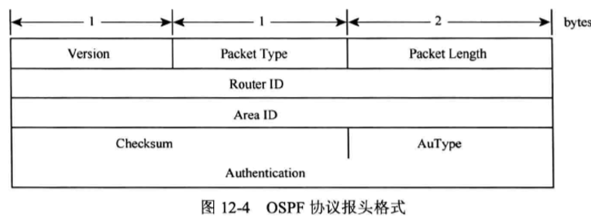
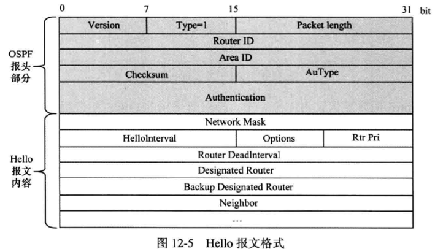

# OSPF配置与管理
OSPF（open shortest path protocol）是一个基于链路状态进行路有计算的动态路由协议。是一种IGP路由协议，OSPF只用于一个AS内部。OSPF是通过LSA（链路状态通告）报文进行路由信息交互，通过5种报文（Hello、DBD、LSR、LSU、LSAck）进行邻居和邻居关系的建立以及同一区域内部各路由器间的LSDB（链路状态数据库）信息的同步，最终形成同一的区域内拓扑数据库。
## OSPF基础
OSPF（open shortest path protocol，开放式最短路径有限）协议是IETF组织开发的一个基于链路状态的AS内部的IGP（内部网管协议）。
RIP因为存在收敛慢、路由环路、可扩展性差等问题逐渐被OSPF取代。IPv4协议使用OSPFv2（RFC2328），IPv6协议使用OSPFv3（RFC2740）版本。
### OSPF的几个个重要概念
一台运行OSPF协议路由器中的每个OSPF进程必须制定一个用于标识本地路由器的Router ID。Router ID是一个32bits无符号整数。**在一个AS中每个Router ID必须唯一，但同一路由器的不同进程中的Router ID可以相同。**

1. AS 自制系统（通常所说的Routing Domain），是由运行同一种路由协议并且被统一组织机构管理的一组路由器组成。**同一个AS中的所有路由器必须运行相同的路由协议，且必须彼此相互连接（中间不能被其他协议陆游域所间断），分配相同的AS号。**IS-IS、BGP等动态路由协议也可以配置AS，形成特定的路由域。

    **在OSPF网络中能够，只有在同一AS中的路由器才会相互交换链路状态信息；在同一个AS中，所有的OSPF路由器都维护一个相同AS结构描述（就是AS中各区域间的链接关系（的数据库。**该数据库中菜鸟房的是路由域中相应链路的状态信息，然后OSPF通过这个数据库计算出其OSPF路由表。
2. Area
Area区域是OSPF的一个重要特征，就是在一个AS内部uafen的多个不同位置，或者不同角色的一组路由器单元，**每个OSPF路由器只能在所属Area内部学习到完整的链路状态信息。**

图12-1所示为Area与AS之间的关系示意图，即一个AS中可以包括多个区域，不同的协议路由域使用不同的AS。**但只有OSPF和IS-IS协议Routing domain AS可以划分多个区域。**不同Routing Domain要经过BGP协议进行连接。

  OSPF的Area辩解是设备接口，而不是链路。即一个网段（链路）只能整个属于同一个Area，**即路由器间直接链接的链路两端接口必须属于同一个Area。**

  在OSPF中，除了可以划分多个普通Area外，还可以配置多种特殊区域，如骨干区域（固定为Area0）、Stub（末梢）区域、Totally Stub（完全末梢）区域，NSSA（非除末梢）区域和Totally NSSA（完全非纯末梢）区域，

3. 路由器类型
  由于OSPF把一个AS划分成了多个区域，路由器在AS中的不同位置，可以划分为一下4类。
    1. 区域内路由器（Internal Routers，IR）：所有接口都在同一个OSPF区域内。
    2. 区域辩解路由器（Area Border Routers，ABR）：接口可以分别属于不同区域，但其中一个接口必须链接骨干区域。ABR用来链接骨干区域和非骨干区域，它与骨干区域之间既可以是物理连接，也可以是逻辑上的连接（虚连接）。
    3. 骨干路由器（Backbone Routers,BR）：至少有一个接口属于骨干区域，所有的ABR和位于骨干区域内部的设备都似乎骨干路由器。
    4. 自制系统辩解路由器i（AS boundary Routers，ASBR),与其他AS中的设备交换路由信息的设备为ASBR，**虽然ASBR通常是位于AS的编辑额，但也可以是IR，也可以同时是ABR。只要一台OSPF设备引入了外部路由（包括之直连路由、静态路由、RIP、IS-IS、BGP，或者其他OSPF进程路由等（的信息它就成了ASBR。
4. 路由类型
划分区域的目的就是想减少LSA的数量，贾绍路由器上依据
   1. 区域内（Intra Area）路由
   2. 区域间（Inter Area）路由
   3. 第一类外部（Type1 External）路由
   4. 第二类外部（Type2 External）路由

### OSPF网络的设计考虑
1. OSPF 网络的涉及规划
    1. 确定需要运行OSPF协议的路由器
    2. 合理划分OSPF区域

    当一个大型网络中的路由器都运行OSPF协议时，LSDB会占用大量的存储空间，并似的SPF算法的复杂度增加，导致CPU负担加重。

    3. 注意ABR和ASBR的性能要求
    
    在OSPF网络中，每个ABR都要负责所连接的两个或多个区域间的路由信息传输工作，需要保存每个链接区域的LSDB，而ASBR更是要负责两个或多个自制系统间的路由信息传输，需要保存每个链接自制系统的LSDB，负担都非常重，所以ABR要由性能比较高的路由器来承担。ASBR的性能要求更高，同时因为一个ABR可以连接多个区域，为了不使ABR的负担太重，通常建议在一台ABR上一般最多链接三个区域，即一个骨干区域和两个普通区域。一个ASBR不要链接太多的自治系统。

2. OSPF区域划分原则 
    1. 按照地理区域或者行政管理单位来划分
    2. 按照网络中单路由器性能来划分
    3. 按照IP网段来划分
    4. 区域中路由器数考虑

### OSPF LSA类型

OSPF是一种典型的链路状态路由协议，缺省情况下，采用OSPF的路由器通过向邻居路由器发送LSA（LInk State Advertisement,链路状态通过)来实现彼此交换并保存整个网络的链路状态信息，从而掌握拳王的拓扑结构，**并独立计算路由**。划分区域后，OSPF路由器手机其所在Area上各路由器的链路状态信息，并生成LSDB，也称为拓扑数据库，因为它代表了对应区域中的网络拓扑结构。然后OSPF路由器根据自己的LSDB利用SPF路由算法独立地计算出到达任意目的地的路由。

OSPF将LSA分为以下几类。

1. Tyuep1 LSA：Router LSA
    每个OSPF路由器都会产生 Router LSA，描述了对应设备物理接口所连接的链路或接口，并且指明了各链路的状态、开销等参数。

2. Type2 LSA：network LSA
3. 

### 几种特殊的OSPF区域

### OSPF的网络类型

1. Broadcast
2. NBMA（Non-Broadcast Multi-Access）
3. point-to-multipoint，P2MP
4. P2P

| Broadcast | 特点 | 缺省选择 |
| -- | -- | -- |
| Broadcast | 通常以组播形式发送Hello报文、LSU和LSAck，以单播形式发送DD和LSR | 当链路层协议是Ethenet、FDDI时，缺省情况下OSPF认为网络类型是Broadcast |
| NBMA | 以单播形式发送Hello、DD、LSR、LSU、LSAck。NBMA网络必须是全联通的，即网络中任意两台路由器之间必须直接可达 | 当链路层协议是ATM时，OSPF认为网路类型是NBMA |
| P2P | 以组播形式发送Hello、DD、LSR、LSU、LSAck | 当链路层协议是PPP、HDLC和LAPB、OSPF认为网络类型是P2P |
| P2MP | 以组播形式发送Hello，以单播形式发送DD、LSR、LSU、LSAck、P2MP网络中的掩码长度必须一致 | 没有一种链路层协议会被缺省为P2MP类型，必须是由其他的网络类型强制更改的 |

## OSPF报头及各种报文格式

OSPF把自制系统划分成逻辑意义上的一个或多个区域。通过LSA的形式发布路由信息，然后依靠OSPF区域内各设备间各种OSPF保温的交互来打到区域内路由信息的统一，最终在区域内部路由器中构建成完全同步的LSDB。因为OSPF是专为TCP/IP网络而设计的路由协议，所以OSPF的各种报文是封装在IP报文内的，可以采用单播或者组播的形式发送。

### OSPF协议报头格式
OSPF报文主要有5种：hello、DD（database Description，数据库描述）、LSR（linkState Request)，LSU（linkState Update）和LSAck（LinkState Acknowledgment）。他们使用相同的OSPF报头格式。如图12-4

1. Version
2. Packet Type
3. Packet length
4. Router ID
5. Area ID
6. Checksum
7. AuType
8. Authentication

### OSPF Hello 报文及格式

