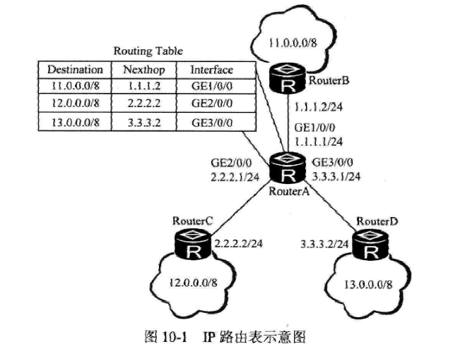

# 静态路由配置与管理
## 路由基础
“路由”简单的说就是报文从源端到目的端的整条传输路径。
## 路由分类
1. 静态路由
2. 直连路由
3. 动态路由 RIP OSPF IS-IS BGP 等
## 路由表和FIB表
路由器转发过程中的两张表 Routing Taible、Forwarding Information Base
###路由表
每台运行动态路由协议的路由器至少有两张路由表，
1.本地核心路由表  
通常说的IP路由表，用来保存本地路由器到达网络中各目的地的**当前各种最佳协议路由，只有到达某一目的地到最佳路由才会出现在本地核心路由表里**，并负责把这些最佳路由表项下发给FIB表，生成对应的FIB表项，指导报文到转发。
2.协议路由表
存放着该协议已发现的所有路由信息，**但就所有路由来说，协议路由表发现到路由不一定是最佳路由，也就是不一定会最终用来进行数据报文路由。**路由协议可以引入并发布其他协议生成到路由。例如，在路由器上运行OSPF协议，需要使用OSPF系诶通告直连路由、静态路由或者IS-IS路由路由时，则要先将这些路由引入OSPF协议的路由表中。

查看路由器的IP路由表信息命令`display ip routing-table ` 

IP路由表包含以下字段。
1. Destination：路由的目的地址。用来表示IP包的目的地址或目的网络。
2. Mask：目的地址的子网掩码长度，与目的地址一起来标识目的主机或目的网络所在的网段地址。
3. Proto：学习此路由的路由协议。包括Static、Direct和各种动态路由。
4. Pre：preference，表示此路由协议优先级。用来比较不同协议类型、相同目的地址的多条路由的优先级。同一目的地可能存在不同的下一跳、出接口等多条路由，这些不同的路由可能是由不同的路由协议发现的，也可以是手工配置的静态路由，优先级高（树枝小）的将成为当前的最佳路由。
5. Cost：路由开销，**这是用来比较同一种协议类型、相同目的地址的多条路由的优先级**。但不同类型协议陆游的开销类型不同，如距离适量协议采用的是*距离*，即将*跳数*作为路由开销，而链路状态类协议采用的是*链路状态*（由链路带宽、网络传输性能等参数共同决定）作为路由开销。当到达同一目的地的多条路由具有相同的路由优先级时，路由开销最小的将成为当前的最佳路由。
6. NextHop：表示路由的下一跳IP地址。致命数据转发路径中的下一个三层设备。
7. Interface：表示此路由从本地设备发出的出接口。
在图10-1所示的网络中，路由器A与3个网络直接相连，因此在其Routing Table中有3个目的IP地址，下一跳和出接口的直连路由

### FIB表的匹配
 在IP路由表选择好要使用的路由表项后，把这些最佳路由表项下发给FIB表，生成对应的FIB表项。到组合。
查看FIB表信息命令 `display fib`

从中可以看出FIB表中包括Destination、Mask、Nexthop、Flag、TimeStamp、Interface和TunnelID字段，其中Destination、Mask、Nexthop、Interface和IP路由表到对应字段一样。其他3各字段说明如下。

1. Flag：转发表项的标志，可能是以下字母中一个或者多字母。
    * G（Gateway网关路由）：表示下一跳是网关。
    * H （Host主机路由）：表示路由为主机路由。
    * U （up可用路由）：表示路由状态是Up。
    * S （Static静态路由）：表示该路由为手动配置路由。
    * D（Dynamic动态路由）：表示该路由为根据路由算法自动生成的路由。
    * L（Vlink Route）：表示Vlink类型路由。
2. Timestamp：转发表项的时间戳，表示该表项已存在的时间，单位是s。
3. TurrnelID：表示转发表项索引。该值不为0时，表示匹配项的报文通过对应的隧道进行转发。该值为0时，表示报文不通过隧道转发。  

因为在iP封装中，**IP报文只封装了源IP地址和目的IP地址，没有封装对应的子网掩码。**所以这时如果在FIB表中有多条同时到达同一目的地，但处于相同自然网段的子网转发项时，就涉及最终选择哪条转发表的问题了。这就是FIB表中的*最长掩码*匹配原则，也即最惊喜路由匹配原则。具体方法是，在查找FIB表时，先将报文的目的地址与FIB中各表项的掩码按位进行*逻辑与*运算，得到匹配的网络地址（可能有多个），然后在这些对应的FIB表项中选择一个最长掩码的FIB表项进行报文转发。

例如，假设路由器上当前的FIB表如前所示，现有一个目的地址是9.1.2.1的报文进入路由器。首先，将目的地址9.1.2.1与FIB表中各表项的掩码长度*0、8、16*所对应的子网掩码进行*逻辑与*运算，得到下面几个网段地址：0.0.0.0/0、9.0.0.0/8、9.1.0.0/16.根据最长掩码匹配原则，最终会选择9.1.0.0/16表项从接口GE2/0/0转发这条目的地址是9.1.2.1的报文。

## 路由协议的优先级
在某一时刻到某一目的地的当前路由**仅能由唯一的路由协议来决定。*为了判断最佳路由，具有较高优先级的路由协议发现的路由将为最佳路有，并将最佳路由放入IP路由表中。

路由协议的优先级分为**外部优先级*和内部优先级*两种。选择路由时先比较路由的外部优先级，当不同的路由协议配置了相同的外部优先级时，系统才会通过内部优先级决定哪个路由协议发现的路由（内部优先级最高的）将成为最佳路由。**

**路由协议缺省时的外部优先级**

| 路由协议类型    | 路由协议的外不优先级| 
| ------------- |:-------------:| 
| DIRECT	 |0|
|OSPF     | 10 | 
|IS-IS    | 15 |  
|STATIC | 60   |  
| RIP| 100   |  
| OSPF ASE | 150     |  
| OSPF NSSA| 150     |  
| BGP | 255     |  
| EBGP | 255    |  

**路由协议内部优先级**

| 路由协议类型    | 路由协议的外不优先级| 
| ------------- |:-------------:| 
| DIRECT	 |0|
|OSPF     | 10 |  
|IS-IS LEVEL-1 |15  |  
| IS-IS LEVEL-2| 18   |  
| STATIC| 60    |  

## 路由的收敛

路由收敛是指网络拓扑变化引起的通过重新计算路有而发生替代路有的行为。路由收敛优先级从高到低分为*critical临界*、*high*、*medium*、*low* 4种。缺省情况下，公网路由收敛优先级如下表：

| 路由协议或路有种类   | 收敛优先级| 
| ------------- |:-------------:| 
| DIRECT	 |high|
|STATIC    | medium| 
|OSPF和IS-IS的32位主机路由     | medium|  
|OSPF除32位主机路由外| low  |  
| IS-IS除32为主机路由外 | low|  
| RIP | low     |  
| BGP      | low   |  

对于私网路由，除了OSPF和IS-IS的32为主机路由标识为medium外，其余路由统一标识为low。

---
# OSPF配置与管理
OSPF（open shortest path protocol）是一个基于链路状态进行路有计算的动态路由协议。是一种IGP路由协议，OSPF只用于一个AS内部。OSPF是通过LSA（链路状态通告）报文进行路由信息交互，通过5种报文（Hello、DBD、LSR、LSU、LSAck）进行邻居和邻居关系的建立以及同一区域内部各路由器间的LSDB（链路状态数据库）信息的同步，最终形成同一的区域内拓扑数据库。
## OSPF基础
OSPF（open shortest path protocol，开放式最短路径有限）协议是IETF组织开发的一个基于链路状态的AS内部的IGP（内部网管协议）。
RIP因为存在收敛慢、路由环路、可扩展性差等问题逐渐被OSPF取代。IPv4协议使用OSPFv2（RFC2328），IPv6协议使用OSPFv3（RFC2740）版本。
## OSPF的几个个重要概念
一台运行OSPF协议路由器中的每个OSPF进程必须制定一个用于标识本地路由器的Router ID。Router ID是一个32bits无符号整数。**在一个AS中每个Router ID必须唯一，但同一路由器的不同进程中的Router ID可以相同。**

1. AS 自制系统（通常所说的Routing Domain），是由运行同一种路由协议并且被统一组织机构管理的一组路由器组成。**同一个AS中的所有路由器必须运行相同的路由协议，且必须彼此相互连接（中间不能被其他协议陆游域所间断），分配相同的AS号。**IS-IS、BGP等动态路由协议也可以配置AS，形成特定的路由域。

    **在OSPF网络中能够，只有在同一AS中的路由器才会相互交换链路状态信息；在同一个AS中，所有的OSPF路由器都维护一个相同AS结构描述（就是AS中各区域间的链接关系（的数据库。**该数据库中菜鸟房的是路由域中相应链路的状态信息，然后OSPF通过这个数据库计算出其OSPF路由表。
2. Area
Area区域是OSPF的一个重要特征，就是在一个AS内部uafen的多个不同位置，或者不同角色的一组路由器单元，**每个OSPF路由器只能在所属Area内部学习到完整的链路状态信息。**

  一个AS中可以包括多个区域，不同的协议路由域使用不同的AS。**但只有OSPF和IS-IS协议Routing domain AS可以划分多个区域。**不同Routing Domain要经过BGP协议进行连接。

  OSPF的Area辩解是设备接口，而不是链路。即一个网段（链路）只能整个属于同一个Area，**即路由器间直接链接的链路两端接口必须属于同一个Area。**

  在OSPF中，除了可以划分多个普通Area外，还可以配置多种特殊区域，如骨干区域（固定为Area0）、Stub（末梢）区域、Totally Stub（完全末梢）区域，NSSA（非除末梢）区域和Totally NSSA（完全非纯末梢）区域，

3. 路由器类型
  由于OSPF把一个AS划分成了多个区域，路由器在AS中的不同位置，可以划分为一下4类。
    1. 区域内路由器（Internal Routers，IR）：所有接口都在同一个OSPF区域内。
    2. 区域辩解路由器（Area Border Routers，ABR）：接口可以分别属于不同区域，但其中一个接口必须链接骨干区域。ABR用来链接骨干区域和非骨干区域，它与骨干区域之间既可以是物理连接，也可以是逻辑上的连接（虚连接）。
    3. 骨干路由器（Backbone Routers,BR）：至少有一个接口属于骨干区域，所有的ABR和位于骨干区域内部的设备都似乎骨干路由器。
    4. 自制系统辩解路由器i（AS boundary Routers，ASBR),与其他AS中的设备交换路由信息的设备为ASBR，**虽然ASBR通常是位于AS的编辑额，但也可以是IR，也可以同时是ABR。只要一台OSPF设备引入了外部路由（包括之直连路由、静态路由、RIP、IS-IS、BGP，或者其他OSPF进程路由等（的信息它就成了ASBR。
4. 路由类型
划分区域的目的就是想减少LSA的数量，贾绍路由器上依据
   1. 区域内（Intra Area）路由
   2. 区域间（Inter Area）路由
   3. 第一类外部（Type1 External）路由
   4. 第二类外部（Type2 External）路由

## OSPF网络的设计考虑

# BFD和NQA配置与管理
# IS-IS配置与管理
# BGP路由配置与管理
# 

